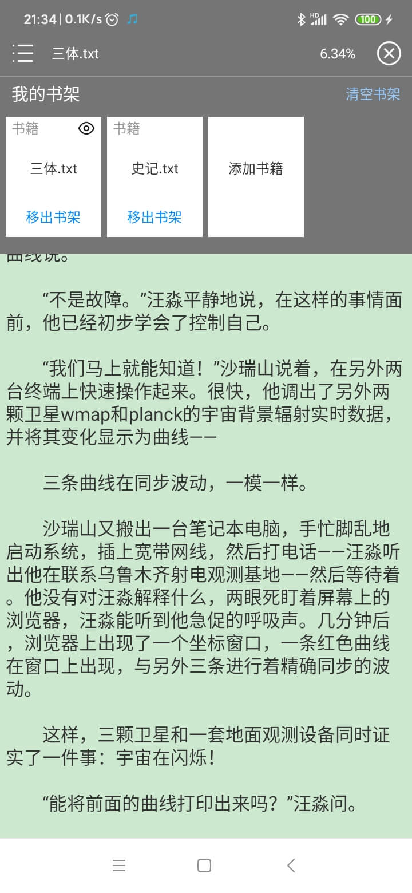
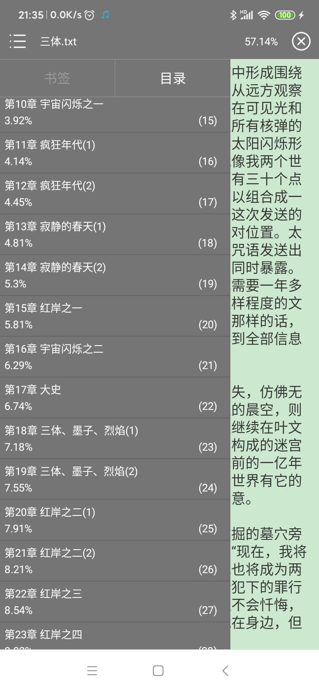

# AndroidBookReader
A simple book reader plug-in

## Installation Adding to project
1.Add the Jcenter repository to your build file
```
buildscript {
    repositories {
        jcenter()
    }
}
```
2.Add the dependency
```
dependencies {
    implementation 'gapp.season:bookreader:1.0.2'
}
```

## Usage
```
//initialize when Application.onCreate()
BookReader.config(isdev, pageTheme, bookDir);

//read book (bookFilePath can be null)
BookReader.readBook(context, bookFilePath);
```

## Preview
   
